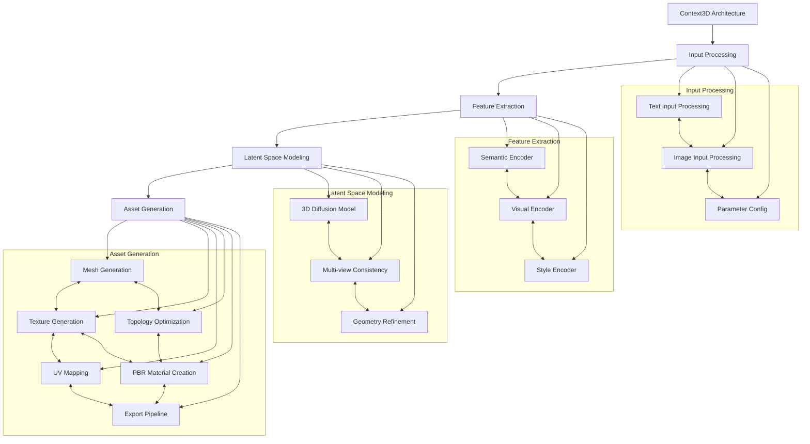
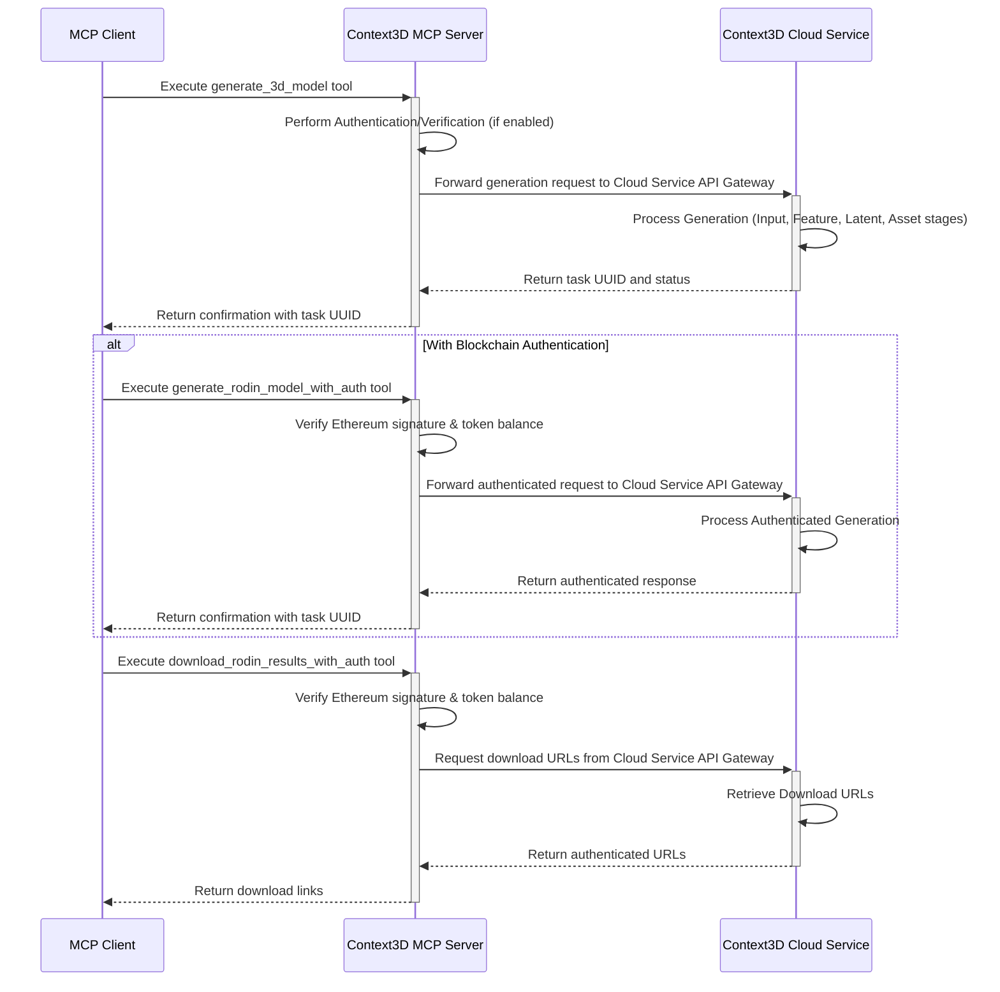
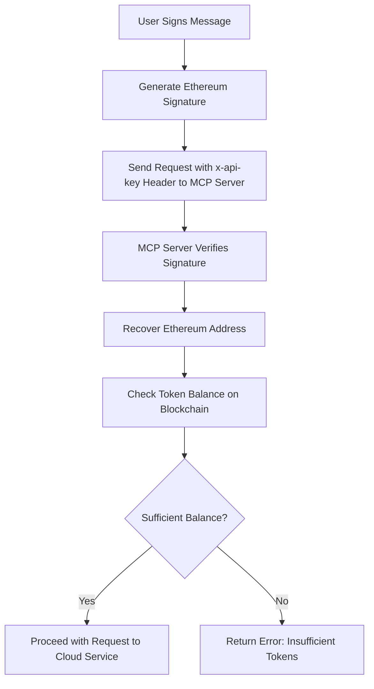

# Context3D - AI-Powered 3D Model Generation with MCP

<div align="center">
  <h3>Generating production-ready 3D models and PBR textures from text and images with MCP Integration</h3>
</div>

---

## 🔍 Overview

This repository contains the **Context3D MCP Server**, a specialized component that integrates the advanced Context3D AI-powered 3D asset generation capabilities with the Model Context Protocol (MCP). While the core Context3D services handle the complex process of generating production-ready 3D models from text prompts or reference images using proprietary diffusion models and extensive datasets, this MCP server provides a standardized interface to access these capabilities via MCP.

The core Context3D services leverage a multi-stage pipeline for 3D asset generation, including input processing, feature extraction, latent space modeling, and asset generation components. This results in high-quality, CG-friendly assets compatible with Unity, Unreal Engine, Maya, and other industry-standard platforms.

This repository's focus is the MCP server, which includes a secure authentication layer that can use blockchain technology to verify users based on their token holdings before allowing access to the underlying Context3D generation services.

### Key Features of the Context3D Platform:

- **Text-to-3D**: Generate detailed 3D models from text descriptions
- **Image-to-3D**: Convert reference images into 3D models with matching textures
- **Hyper-realistic PBR textures**: Auto-generated diffuse, normal, roughness, and metallic maps
- **Production-ready output**: Optimized topology and UV mapping for immediate use
- **Multi-platform compatibility**: Export to common formats (.fbx, .obj, .gltf, .usd)
- **Facial specialization**: Advanced capabilities for human facial asset generation

### Key Features of this MCP Server:

- **MCP Integration**: Full compatibility with the Model Context Protocol for accessing Context3D services.
- **Blockchain Authentication**: Secure access control based on token holdings for using the Context3D services via MCP.
- **File Management Tools**: Built-in MCP tools for managing generated assets.
- **Customization Options**: MCP interface for controlling core Context3D model generation parameters.

---

## 🏗️ Technical Architecture

This repository focuses on the MCP Server component, which interacts with the core Context3D Cloud Service.

### Core Context3D Cloud Service Pipeline (Detailed in plant.md)

The core Context3D Cloud Service utilizes a multi-stage pipeline:



_Note: This diagram represents the core Context3D Cloud Service pipeline, not the MCP Server in this repository._

### MCP Server Communication Flow

This diagram illustrates the communication flow between an MCP client and the server, including interaction with the core Context3D Cloud Service:



### Authentication Flow (within MCP Server)

The blockchain authentication process within the MCP Server works as follows:



---

## MCP Integration Guide

### Adding the MCP Server to Claude Desktop

Follow these steps to integrate the Context3D MCP server with Claude Desktop:

1. **Install Claude Desktop**:
   - Download the latest version of Claude Desktop from the official website ([https://claude.ai/download](https://claude.ai/download))
   - Follow the installation prompts for your operating system (Windows, macOS, or Linux)
   - Complete the installation and launch Claude Desktop
   - Sign in with your Anthropic account credentials if prompted

2. **Configure Claude Desktop**:
   - Install Node.js (version 16 or higher) from https://nodejs.org
   - Clone the Context3D MCP server repository:
     ```bash
     git clone https://github.com/Context3D/context3d-model-mcp-server
     cd context3d-model-mcp-server
     ```
   - Install dependencies using your preferred package manager:
     ```bash
     npm install
     # or
     pnpm install
     # or
     yarn install
     ```
   - Build the MCP server:
     ```bash
     pnpm build
     ```
   - Create or update the Claude configuration file. On Windows, this is typically located at `%APPDATA%\Claude\config.json`. On macOS, it's at `~/Library/Application Support/Claude/config.json`. On Linux, it's at `~/.config/Claude/config.json`.
   - Add the following JSON configuration, making sure to replace the path with your actual build directory path:
     ```json
     {
       "mcpServers": {
         "filesystem": {
           "command": "node",
           "args": [
             "/full/path/to/context3d-model-mcp-server/build/index.js"
           ],
           "env": {
             "SAVE_TO_DESKTOP": "true"
           }
         }
       }
     }
     ```
   - Save the configuration file and restart Claude Desktop
   - Verify the MCP server is running by checking for the Context3D tools in the tools panel

3. **Using the Server**:

  - https://x.com/Context3D/status/1922998936219873558


  ---

<div align="center">
  <p>© 2025 Context3D AI | <a href="https://context3d.ai">https://context3d.ai</a></p>
</div>
